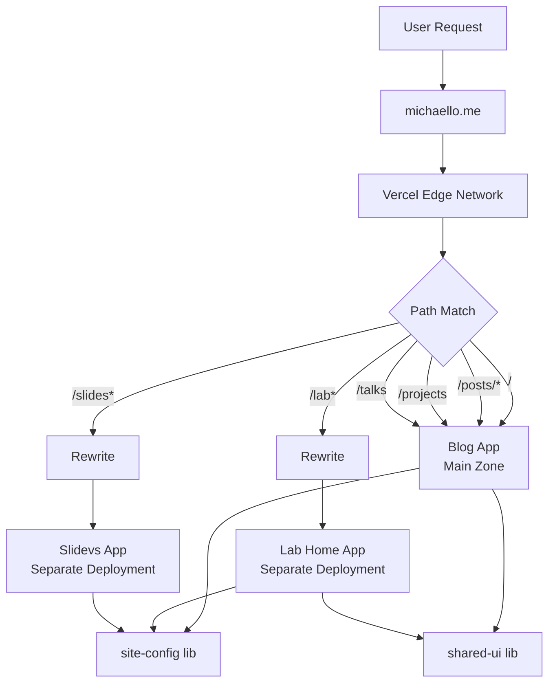

# Milo Me - Personal Website Monorepo

A modern Nx monorepo for [michaello.me](https://michaello.me) using Next.js Multi-Zones architecture.

## 🏗️ Architecture

### Multi-Zones Design

This monorepo serves **multiple independent Next.js applications** under a **single domain** using Next.js Multi-Zones pattern.

```
michaello.me/              → blog app (Main Zone)
michaello.me/posts/*       → blog app
michaello.me/projects      → blog app
michaello.me/talks         → blog app

michaello.me/lab           → lab-home app (Rewrite Zone)
michaello.me/lab/*         → lab-home app

michaello.me/slides        → slidevs app (Rewrite Zone)
michaello.me/slides/*      → slidevs app
```

**How it works:**

- `blog` app is the **main zone** (no basePath)
- `lab-home` and `slidevs` apps have their own `basePath`
- Main zone's `next.config.js` contains `rewrites()` to route `/lab/*` and `/slides/*` to their Vercel deployments
- Each app is **deployed separately** on Vercel
- User sees **one unified domain**

### Project Structure

```
milo-me-new/
├── apps/
│   ├── blog/                      # Main Zone (michaello.me)
│   │   ├── src/app/
│   │   │   ├── page.tsx          # Homepage (blog posts list)
│   │   │   ├── posts/[[...slug]]/  # Blog posts (Fumadocs)
│   │   │   ├── projects/         # Projects page
│   │   │   └── talks/            # Talks page
│   │   ├── content/posts/        # MDX blog content
│   │   │   ├── frontend/
│   │   │   ├── backend/
│   │   │   ├── leetcode/
│   │   │   └── tech-talk/
│   │   └── next.config.js        # ⭐ Multi-Zones rewrites config
│   │
│   ├── lab/home/                 # Lab Zone (michaello.me/lab)
│   │   ├── src/app/page.tsx     # Lab projects list
│   │   └── next.config.js        # basePath: '/lab'
│   │
│   └── slidevs/                  # Slides Zone (michaello.me/slides)
│       ├── 2025-06-29/           # Date-organized presentations
│       │   └── src/slides.md
│       └── next.config.js        # basePath: '/slides'
│
└── libs/
    ├── site-config/              # Shared site metadata
    │   └── src/
    │       ├── index.ts          # Author, social, analytics config
    │       └── components/       # GoogleAnalytics, PostHog
    └── shared-ui/                # Shared UI components
        └── src/components/ui/    # shadcn/ui components
```

### Key Architecture Principles

1. **Independent Deployment**: Each app has its own Vercel project
2. **Shared Libraries**: `site-config` and `shared-ui` are shared via Nx workspace
3. **Type Safety**: TypeScript strict mode across all apps
4. **Zero-Config Styling**: Tailwind CSS v4 (no config file needed)
5. **Content-Driven**: Blog uses Fumadocs MDX loader with static generation

## 🚀 Tech Stack

| Layer               | Technology                        |
| ------------------- | --------------------------------- |
| **Monorepo**        | Nx 21.6.3                         |
| **Framework**       | Next.js 15.3.0 (App Router)       |
| **Runtime**         | React 19.0.0                      |
| **Language**        | TypeScript 5.9.2                  |
| **Styling**         | Tailwind CSS v4.0.0 (zero-config) |
| **Documentation**   | Fumadocs v15.8.3                  |
| **Presentations**   | Slidev v51.8.1 (Vue 3)            |
| **Components**      | shadcn/ui                         |
| **Package Manager** | pnpm                              |
| **Deployment**      | Vercel (Multi-Zones)              |

## 🌐 Deployment Architecture

Each app is deployed as a **separate Vercel project**:

| App          | Vercel Project       | Domain         | Build Command                   | Output Dir            |
| ------------ | -------------------- | -------------- | ------------------------------- | --------------------- |
| **blog**     | `michaello-blog`     | `michaello.me` | `pnpm nx build blog --prod`     | `apps/blog/.next`     |
| **lab-home** | `michaello-lab-home` | (via rewrite)  | `pnpm nx build lab-home --prod` | `apps/lab/home/.next` |
| **slidevs**  | `michaello-slides`   | (via rewrite)  | `pnpm nx build slidevs --prod`  | `apps/slidevs/.next`  |

**Multi-Zones Configuration** (`apps/blog/next.config.js`):

```javascript
async rewrites() {
  return [
    {
      source: '/lab',
      destination: 'https://michaello-lab-home.vercel.app/lab'
    },
    {
      source: '/lab/:path*',
      destination: 'https://michaello-lab-home.vercel.app/lab/:path*'
    },
    {
      source: '/slides',
      destination: 'https://michaello-slides.vercel.app/slides'
    },
    {
      source: '/slides/:path*',
      destination: 'https://michaello-slides.vercel.app/slides/:path*'
    }
  ]
}
```

**Note**: Update Vercel URLs after deploying `lab-home` and `slidevs` projects.

## 🚦 Quick Start

```bash
# Install dependencies
pnpm install

# Development
pnpm dev                    # All apps
pnpm nx dev blog            # Specific app
pnpm nx dev lab-home

# Production build
pnpm build                  # All apps
pnpm nx build blog --prod   # Specific app

# Code quality
pnpm lint
pnpm format
pnpm type-check
```

## 📊 Data Flow



## 📦 Shared Libraries

### `site-config`

Centralized site configuration for all apps:

```typescript
import { siteConfig } from '@milo-me/site-config';

siteConfig.author; // { name, url }
siteConfig.site; // { name, title, description, url }
siteConfig.social; // { github, linkedin, rss }
siteConfig.analytics; // { googleAnalyticsId, posthogApiKey }
```

### `shared-ui`

Shared UI components (shadcn/ui):

```typescript
import { Button, Card } from '@milo-me/shared-ui';
```

## 🎯 Design Decisions

| Decision                      | Rationale                                                           |
| ----------------------------- | ------------------------------------------------------------------- |
| **Multi-Zones over Monolith** | Independent scaling, deployment, and tech stack per app             |
| **Nx Monorepo**               | Code sharing, unified tooling, dependency graph                     |
| **Separate Vercel Projects**  | Isolated deployments, independent CI/CD pipelines                   |
| **Tailwind CSS v4**           | Zero-config, faster builds, better DX                               |
| **Fumadocs**                  | MDX-first, type-safe, excellent DX for documentation                |
| **Slidev**                    | Markdown-based slides with Vue 3, code highlighting, presenter mode |

## 📚 Documentation

- **[CLAUDE.md](./CLAUDE.md)** - Complete development guide for AI assistants
  - Commit conventions
  - Development patterns (RADIO + TDD + DDD)
  - Detailed build/deployment instructions

## 🔗 References

- [Next.js Multi-Zones](https://nextjs.org/docs/advanced-features/multi-zones)
- [Nx Monorepo](https://nx.dev)
- [Fumadocs](https://fumadocs.vercel.app)
- [Tailwind CSS v4](https://tailwindcss.com/blog/tailwindcss-v4-beta)

---

**License**: Private
**Last Updated**: 2025-10-06
