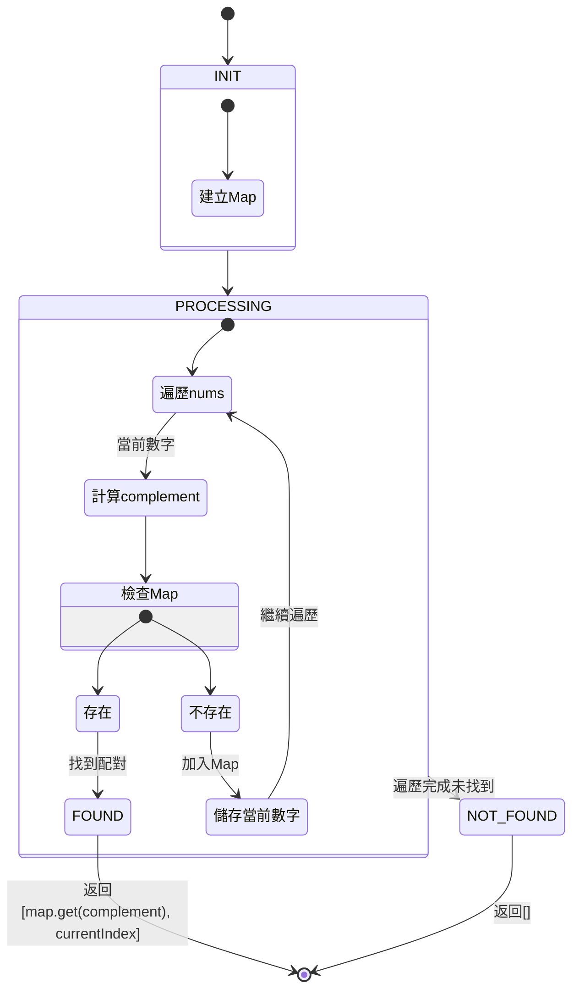

## 解題思路

這題是說給訂一個整數的陣列 nums 和一個整數 target，我們需要去找到兩個數字加起來會等於 target，並回傳這兩個數字的 index。

我選用了 new Map 的解決方式，先說明下什麼是 new Map，new Map 是 JavaScript 中一個內建的資料結構，它是一個 key-value 的集合，並且 key 是唯一的，value 可以重複。

### 複雜度分析

- 時間複雜度：O(n)，其中 n 是數組長度
- 空間複雜度：O(n)，需要一個 Map 來存儲已遍歷的數字

## 解題狀態機 (XState 風格)



## 狀態說明

1. **INIT**: 初始化狀態

   - 建立空的 Map 物件作為查找表

2. **PROCESSING**: 主要處理邏輯

   - 遍歷陣列中的每個數字
   - 計算 complement (target - 當前數字)
   - 檢查 complement 是否存在於 Map 中
   - 如果不存在，將當前數字存入 Map

3. **FOUND**: 成功找到配對

   - 返回找到的兩個索引值

4. **NOT_FOUND**: 遍歷完成但未找到配對
   - 返回空陣列

## 解題步驟

1. 建立一個新的 Map 物件，用來儲存已經遍歷過的數字和它的 index
2. 遍歷 nums 陣列時：
   - 計算 complement（目標值減去當前數字）
   - 檢查 complement 是否存在於 Map 中
     - 如果存在：回傳 [已存在數字的index, 當前數字的index]
     - 如果不存在：將當前數字和其index加入 Map 中
3. 如果遍歷完 nums 後，還是沒有找到符合條件的數字，我們就回傳一個空的陣列。

## 實作

```javascript
function twoSum(nums, target) {
  const numMap = new Map();

  for (const [index, num] of nums.entries()) {
    const complement = target - num;
    if (numMap.has(complement)) {
      return [numMap.get(complement), index];
    }
    numMap.set(num, index);
  }
  return [];
}
```

## 解題心得

這題的解法是使用一個 hash map 來儲存已經遍歷過的數字和它的 index，接著我們再遍歷 nums 的時候，我們去檢查 target - nums[i] 是否在 hash map 中，如果有的話，我們就回傳這兩個數字的 index，如果沒有的話，我們就將 nums[i] 和它的 index 存入 hash map 中。
